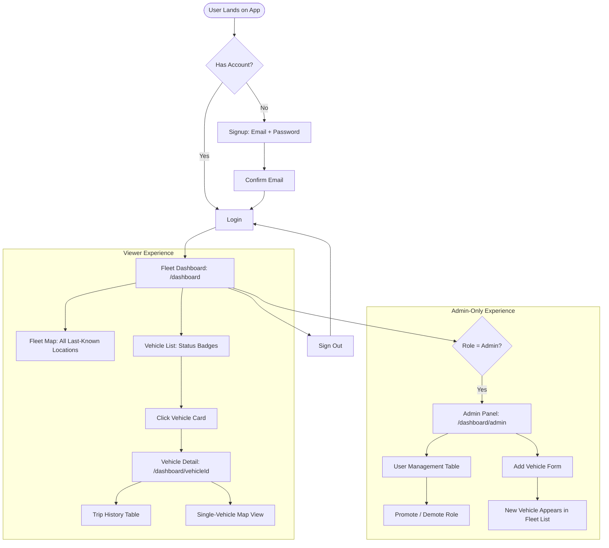

# Mock UX Design & User Experience Specification
**Project:** Fleet Dashboard (MapmyIndia)
**Module:** Product Design Planning & Low-Fidelity Wireframes
**Team:** Team 04

---

## 1. Product Problem Statement & UX Objective

> **"Fleet operators managing up to 10,000 vehicles need a single dashboard to view their fleet, see each vehicle's last known location on a map, and review per-vehicle trip history — without the dashboard slowing down as the fleet grows."**

### Core UX Objectives:
1. **Viewer Workflow:** Let a fleet manager or dispatcher scan the entire fleet at a glance, drill into any single vehicle, and understand its recent activity in under 5 seconds per screen.
2. **Admin Workflow:** Give fleet admins the ability to manage user access (promote/demote roles) and manage fleet records (add/remove vehicles) without needing a separate tool.
3. **Information Hierarchy:** Map and status overview first, searchable/filterable vehicle list second, detailed trip history third — following the 5-second scan rule.
4. **Performance-First UX:** Every screen must communicate loading/empty/error states clearly, since the product's core value proposition is staying fast and legible even at 10,000-vehicle scale.

---

## 2. System User Flow Map



---

## 3. Wireframes & Screen Layouts

### Screen 1: Login (`/login`)
**Primary Mode:** Quick Access Mode

```text
+---------------------------------------------------------------------------------+
|                                                                                   |
|                                                                                   |
|                          +---------------------------------+                     |
|                          |         Sign in                  |                     |
|                          |  Welcome back to the Fleet        |                     |
|                          |  Dashboard.                       |                     |
|                          |                                   |                     |
|                          |  Email                            |                     |
|                          |  [ you@example.com            ]   |                     |
|                          |                                   |                     |
|                          |  Password                         |                     |
|                          |  [ ••••••••                   ]   |                     |
|                          |                     Forgot password? |                  |
|                          |                                   |                     |
|                          |  [        Sign in (Primary)    ]  |                     |
|                          |                                   |                     |
|                          |  --------------- or -------------  |                     |
|                          |  [   Continue with Google (disabled) ]                  |
|                          |                                   |                     |
|                          |  Don't have an account? Sign up  |                     |
|                          +---------------------------------+                     |
|                                                                                   |
+---------------------------------------------------------------------------------+
```

---

### Screen 2: Fleet Dashboard (`/dashboard`)
**Primary Mode:** Monitor & Scan Mode (5-Second Scan)

```text
+---------------------------------------------------------------------------------------------------------+
| Fleet Dashboard                                          shyam@example.com (admin) | Admin Panel | Sign out |
| 10,000 vehicles                                                                                          |
+---------------------------------------------------------------------------------------------------------+
|                                                                                                            |
|  FLEET MAP — LAST KNOWN LOCATIONS                                                                         |
|  +------------------------------------------------------------------------------------------------------+ |
|  |                                                                                                        | |
|  |     📍           📍  📍         [Clustered markers grouped by proximity]        📍                    | |
|  |          📍   ⊕ 1,204        📍             📍       ⊕ 842            📍   📍                          | |
|  |                                                                                                        | |
|  |  [Filter: All ▾]  [ ● Active   ● Idle   ● Offline ]                                                    | |
|  +------------------------------------------------------------------------------------------------------+ |
|                                                                                                            |
|  VEHICLE LIST                                            [ Filter Status: All ▾ ]  [ Search vehicle... ]  |
|  +---------------------+  +---------------------+  +---------------------+                                |
|  | Vehicle 1    [ACTIVE]|  | Vehicle 2     [IDLE] |  | Vehicle 3  [OFFLINE]|                                |
|  | RJ141001              |  | RJ141002              |  | RJ141003              |                            |
|  | vehicle-00001         |  | vehicle-00002         |  | vehicle-00003         |                            |
|  +---------------------+  +---------------------+  +---------------------+                                |
|  | Vehicle 4    [ACTIVE]|  | Vehicle 5    [ACTIVE]|  | Vehicle 6     [IDLE] |                                |
|  | RJ141004              |  | RJ141005              |  | RJ141006              |                            |
|  +---------------------+  +---------------------+  +---------------------+                                |
|                                                                                                            |
|  Showing 1-100 of 10,000 vehicles                          [ Load more on scroll ↓ ]                       |
+---------------------------------------------------------------------------------------------------------+
```

---

### Screen 3: Vehicle Detail & Trip History (`/dashboard/[vehicleId]`)
**Primary Mode:** Investigate Mode

```text
+---------------------------------------------------------------------------------------------------------+
| ← Back to Dashboard                                                                                      |
|                                                                                                            |
|  Vehicle Details                                                                                          |
|  Vehicle 1                                                                                                |
|  vehicle-00001                                                                                            |
|                                                                                                            |
|  +------------------------------------------------------------------------------------------------------+ |
|  | VEHICLE INFORMATION                                                                                    | |
|  | Vehicle ID: vehicle-00001  | Registration: RJ141001 | Status: [ACTIVE] | Last Location: 26.91, 75.78  | |
|  +------------------------------------------------------------------------------------------------------+ |
|                                                                                                            |
|  +------------------------------------------------------------------------------------------------------+ |
|  | LAST KNOWN LOCATION                                                                                    | |
|  |                          📍  Vehicle 1                                                                 | |
|  |                          [Popup: Vehicle 1 — Status: Active]                                           | |
|  +------------------------------------------------------------------------------------------------------+ |
|                                                                                                            |
|  TRIP HISTORY                                                        5 trips found                        |
|  +------------------------------------------------------------------------------------------------------+ |
|  | TRIP ID    | START TIME        | END TIME          | DISTANCE | START LOCATION  | END LOCATION       | |
|  +------------+-------------------+-------------------+----------+-----------------+--------------------+ |
|  | trip-000001| Aug 20, 9:02 AM   | Aug 20, 10:41 AM  | 84.3 km  | 26.91, 75.78    | 27.02, 75.91       | |
|  | trip-000002| Aug 22, 2:15 PM   | Aug 22, 3:00 PM   | 22.7 km  | 26.88, 75.80    | 26.95, 75.85       | |
|  | trip-000003| Aug 24, 8:00 AM   | Aug 24, 11:20 AM  | 190.5 km | 26.90, 75.79    | 27.40, 76.10       | |
|  +------------------------------------------------------------------------------------------------------+ |
|                                                    [ Load more trips on scroll ↓ ]                         |
+---------------------------------------------------------------------------------------------------------+
```

---

### Screen 4: Admin Panel (`/dashboard/admin`)
**Primary Mode:** Manage & Batch Mode

```text
+---------------------------------------------------------------------------------------------------------+
| Admin — User Management                                                                                   |
| 24 users                                                                                                  |
+---------------------------------------------------------------------------------------------------------+
|                                                                                                            |
|  +------------------------------------------------------------------------------------------------------+ |
|  | ADD VEHICLE                                                                                            | |
|  | [ Vehicle name  ] [ Registration number ] [ Status ▾ ] [ Lat ] [ Lng ]      [ Add Vehicle (Primary) ]  | |
|  +------------------------------------------------------------------------------------------------------+ |
|                                                                                                            |
|  USER LIST                                                                                                 |
|  +------------------------------------------------------------------------------------------------------+ |
|  | EMAIL                    | ROLE     | JOINED        | ACTION                                          | |
|  +---------------------------+----------+---------------+-------------------------------------------------+ |
|  | shyam@example.com         | admin    | Aug 27, 2026  | [ Demote to Viewer ]                            | |
|  | aryan@example.com         | viewer   | Aug 27, 2026  | [ Promote to Admin ]                            | |
|  | parveen@example.com       | viewer   | Aug 27, 2026  | [ Promote to Admin ]                            | |
|  | test.user@example.com     | viewer   | Sep 01, 2026  | [ Promote to Admin ]                            | |
|  +------------------------------------------------------------------------------------------------------+ |
|                                                                                                            |
|  [ Mobile view: stacked cards per user instead of table columns, below 640px width ]                       |
+---------------------------------------------------------------------------------------------------------+
```

---

## 4. Edge Cases: Empty, Loading & Error States

### A. Empty State: No Vehicles Yet
```text
+---------------------------------------------------------------------------------------------------+
|                                                                                                   |
|                                  🚚 No Vehicles in Fleet                                          |
|                    Your fleet is empty. Add your first vehicle to get started.                    |
|                                                                                                   |
|                                  [ + Add Vehicle (Admin only) ]                                   |
|                                                                                                   |
+---------------------------------------------------------------------------------------------------+
```

### B. Empty State: No Trips Recorded
```text
+---------------------------------------------------------------------------------------------------+
|                                     📭 No Trips Recorded Yet                                       |
|                     This vehicle has no trip history logged so far.                                |
+---------------------------------------------------------------------------------------------------+
```

### C. Loading State: Dashboard Skeleton
```text
+---------------------------------------------------------------------------------------------------+
|  [gray pulsing block: title]        [gray pulsing block: sign out button]                          |
|  [gray pulsing block: map, full width, 500px tall]                                                 |
|  [gray box] [gray box] [gray box]   [gray box] [gray box] [gray box]                                |
+---------------------------------------------------------------------------------------------------+
```

### D. Error State: Vehicle Not Found
```text
+---------------------------------------------------------------------------------------------------+
|  ← Back to Dashboard                                                                               |
|                                                                                                   |
|  ⚠️ Vehicle Not Found                                                                             |
|  No vehicle exists with ID: vehicle-99999                                                          |
+---------------------------------------------------------------------------------------------------+
```

### E. Error State: Session Expired / Unauthorized
```text
+---------------------------------------------------------------------------------------------------+
|  ⚠️ Session Expired or Access Denied                                                             |
|  Your session has timed out, or you don't have permission to view this page.                       |
|                                                                                                   |
|  [ 🔄 Refresh Page ]                                    [ 🔐 Log In Again (Primary) ]              |
+---------------------------------------------------------------------------------------------------+
```

### F. Error State: Unauthorized Action (Non-Admin)
```text
+---------------------------------------------------------------------------------------------------+
|  🚫 Unauthorized                                                                                  |
|  Only admins can perform this action.                                                              |
+---------------------------------------------------------------------------------------------------+
```

---

## 5. Design Decisions & Rationale

1. **Marker Clustering on the Fleet Map**: With up to 10,000 vehicles, individual markers become unreadable at default zoom. Clusters collapse nearby vehicles into a single labeled marker (e.g., "⊕ 1,204"), expanding into individual markers on zoom-in.
2. **Status Badges Everywhere**: Active/Idle/Offline is color-coded consistently across the map, vehicle list, and vehicle detail page — a viewer never has to re-learn the color language between screens.
3. **Server-Side Role Re-Check, Not Just Hidden UI**: The Admin Panel and its actions (promote/demote, add vehicle) are gated both by hiding UI for non-admins AND by re-validating the role server-side on every action — a viewer can't call these actions directly even by bypassing the UI.
4. **Skeleton Loading Over Spinners**: The dashboard shows a shaped skeleton (matching the real layout) rather than a generic spinner, so the page doesn't visually "jump" once real content loads.
5. **Static Generation for the Vehicle List**: Directly serving the PRD's core requirement — the vehicle list is statically generated so load time stays flat regardless of fleet size.

---

## 6. Pre-Submission Review Checklist

- [x] **Understandable without verbal explanation**: Clear labels, status badges, and consistent iconography across all screens.
- [x] **Above-the-fold overview**: Fleet map and vehicle count visible immediately on dashboard load.
- [x] **Explicit Filter Interactions**: Status filters and search clearly delineated on both map and list views.
- [x] **Empty, loading, and error states wireframed**: No-vehicles, no-trips, skeleton loading, not-found, unauthorized, and session-expired states all specified.
- [x] **Responsive behavior noted**: Admin table explicitly calls out mobile stacked-card fallback below 640px.
- [x] **Direct PRD Alignment**: Fulfills the PRD's vehicle list, trip history, map, authentication, and role-based access requirements.
