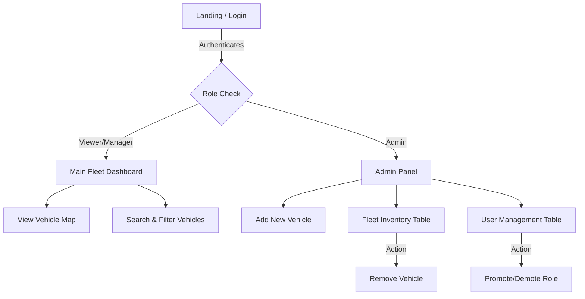

# Mock UX Design & User Experience Specification
**Project:** Fleet Dashboard Analytics
**Module:** Admin Panel & Dashboard Interface
**Role:** Design Planning & Low-Fidelity Wireframes

---

## 1. Product Problem Statement & UX Objective

> **"Fleet managers need a real-time tracking dashboard to monitor vehicle statuses (online, offline, maintenance), location data, and user access. When a vehicle changes status, it should reflect immediately. Admins require a dense, efficient interface to manage both vehicles and team roles from a unified dashboard."**

### Core UX Objectives:
1. **Manager Workflow:** Allow fleet managers to oversee total fleet size, active vehicles, and pinpoint locations quickly. Provide easy filtering and search functionality across the fleet.
2. **Admin Workflow:** Give system administrators a streamlined interface to onboard new vehicles, monitor user signups, and promote/demote roles with a single click.
3. **Information Hierarchy:** Follow the 5-second scan rule — Top KPI metrics first (Total Users, Active Vehicles), actionable lists next, and deep-dive maps or details on demand.

---

## 2. Core User Flows (Mermaid Architecture)



---

## 3. Screen 1: Main Fleet Dashboard (Viewer/Manager)

**Objective:** Quick status overview and real-time tracking.

### ASCII Wireframe
```text
+---------------------------------------------------------+
| [Logo] FleetDash Analytics                 [Sign Out]   |
+---------------------------------------------------------+
|                                                         |
|  [ Total: 42 ]   [ Online: 30 ]   [ Maintenance: 5 ]    |
|                                                         |
|  Search: [ Enter plate or name... ]    Sort: [ Date V ] |
|                                                         |
|  +---------------------------------------------------+  |
|  | Vehicle Name  | Plate No  | Status    | Action    |  |
|  +---------------------------------------------------+  |
|  | Truck Alpha   | KA-01-123 | [Online]  | [Track]   |  |
|  | Van Bravo     | MH-12-456 | [Offline] | [Track]   |  |
|  | Lorry Charlie | DL-09-789 | [Maint.]  | [Track]   |  |
|  +---------------------------------------------------+  |
|                                                         |
+---------------------------------------------------------+
```

### Key Interactions:
- **Search Bar:** Real-time filtering by vehicle name or plate.
- **Status Badges:** Color-coded (Green = Online, Gray = Offline, Orange = Maintenance).
- **Track Button:** Opens a modal or redirects to a live map view for the specific vehicle.

---

## 4. Screen 2: Admin Panel

**Objective:** Centralized control for fleet inventory and user access.

### ASCII Wireframe
```text
+---------------------------------------------------------+
| <- Back to Dashboard           [AdminUser] [Sign Out]   |
| ADMIN PANEL                                             |
+---------------------------------------------------------+
|                                                         |
| = VEHICLE MANAGEMENT ================== [ 42 Total ] == |
|                                                         |
|   Add Vehicle: [Name] [Plate] [Status V]  [ + ADD ]     |
|                                                         |
|   Fleet Inventory:                                      |
|   Truck Alpha  | KA-01-123 | [Online]     | [Delete]    |
|   Van Bravo    | MH-12-456 | [Offline]    | [Delete]    |
|                                                         |
| = USER MANAGEMENT ===================== [ 15 Total ] == |
|                                                         |
|   john@example.com | [Admin]  | Last login: Today | [Demote] |
|   jane@example.com | [Viewer] | Last login: 2d ago| [Promote]|
|                                                         |
+---------------------------------------------------------+
```

### Key Interactions:
- **Quick Add:** Inline form to add a vehicle instantly without navigating away.
- **Role Toggles:** Single-click promotion or demotion with optimistic UI updates.
- **User Activity Metrics:** Displays recent signup dates and last login timestamps to help admins audit inactive accounts.

---

## 5. Design System & Tokens

* **Typography:** Inter (Sans-serif) for high legibility in data tables.
* **Colors:**
  * Primary: `#2563EB` (Blue - Actions, Links)
  * Success: `#16A34A` (Green - Online, Active)
  * Warning: `#D97706` (Orange - Maintenance, Pending)
  * Danger: `#DC2626` (Red - Offline, Delete Actions)
  * Surface: `#F9FAFB` (Gray-50 - Backgrounds)
* **Components:**
  * `Badge`: Rounded pills for status and roles.
  * `Table`: Minimal borders, hover rows (`bg-gray-50`) for tracking focus.
  * `Button`: Disabled states with reduced opacity (`opacity-50`) during transitions.
