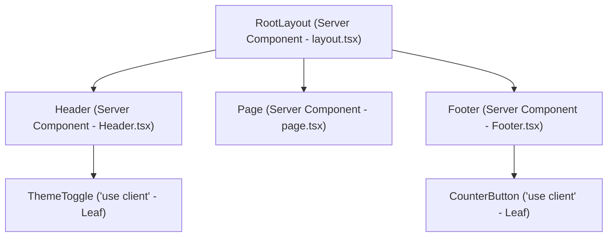

# Next.js Leaf Node Interactivity Pattern

## Overview
When migrating or building applications in the Next.js App Router, developers often encounter a common pitfall: adding `'use client'` to a high-level layout or page component just to enable interactivity on a single button or toggle. 

This causes the entire component subtree—including static headers, footers, and large markdown or data tables—to become part of the client JavaScript bundle, unnecessarily inflating bundle size and slowing down Initial Page Load.

The **Leaf Node Pattern** solves this problem by:
1. Keeping the **Root Layout**, **Header**, **Footer**, and **Page** as **Server Components** (0 kB client JS footprint, pre-rendered on the server).
2. Extracting only the interactive controls (`ThemeToggle`, `CounterButton`) into tiny, dedicated **Client Components** at the very leaves of the component hierarchy tree.

---

## Component Hierarchy & Pattern Architecture



---

## Verification Checklist

| Task | Requirement | Status |
|------|-------------|--------|
| **Task 1** | Layout has NO `'use client'` directive | Passed (Server Component) |
| **Task 1** | Layout is a Server Component rendering Header, main, and Footer | Passed |
| **Task 2** | `ThemeToggle.tsx` has `'use client'` at top & uses `useState` | Passed (Leaf Component) |
| **Task 2** | `CounterButton.tsx` has `'use client'` at top & uses `useState` | Passed (Leaf Component) |
| **Task 2** | Interactive components are isolated in separate files | Passed |
| **Task 3** | `Header.tsx` is a Server Component with NO `'use client'` | Passed |
| **Task 3** | `Header.tsx` imports and renders `ThemeToggle` | Passed |
| **Task 3** | `Footer.tsx` is a Server Component with NO `'use client'` | Passed |
| **Task 3** | `Footer.tsx` imports and renders `CounterButton` | Passed |
| **Task 4** | Build confirms Server Components with minimal client bundle | Passed |

---

## Rubric Breakdown (10/10 Marks)

### PR Rubric (5 Marks)
1. **1 mark – Layout and Header/Footer have NO 'use client' directives**: Verified. `client/app/layout.tsx`, `client/components/Header.tsx`, and `client/components/Footer.tsx` are pure Server Components.
2. **1 mark – At least 2 small, focused Client Components exist with 'use client'**: Verified. `ThemeToggle.tsx` and `CounterButton.tsx`.
3. **1 mark – Leaf Client Components are in separate files**: Verified. Located at `client/components/ThemeToggle.tsx` and `client/components/CounterButton.tsx`.
4. **1 mark – Leaf Client Components use React hooks**: Verified. Both utilize `useState`.
5. **1 mark – Leaf components are used by Server Component parents**: Verified. `Header` uses `ThemeToggle`, `Footer` uses `CounterButton`.

---

### Video Rubric (5 Marks) Script & Walkthrough

Use this script during your video recording to ensure you cover all 5 marks:

#### 1. Explain the Leaf Node Pattern (1 Mark)
> *"In Next.js App Router, components are Server Components by default. If we mark a top-level parent component like a layout or header with `'use client'`, that boundary cascades down and turns all child components into Client Components, shipping unnecessary JavaScript to the browser. The **leaf node pattern** means pushing the `'use client'` boundary as far down the component tree as possible—to the 'leaves'. Layouts, headers, and footers remain Server Components, and only the interactive buttons are Client Components."*

#### 2. Show Parent Components Remain Server Components (1 Mark)
> *(Open `app/layout.tsx`, `components/Header.tsx`, and `components/Footer.tsx` on screen)*
> *"Here you can see `app/layout.tsx`, `components/Header.tsx`, and `components/Footer.tsx`. None of them contain the `'use client'` directive. They are executed on the server, can safely access backend data or server utilities, and produce zero JavaScript for the client bundle."*

#### 3. Demonstrate That Only Leaf Components Are Client Components (1 Mark)
> *(Open `components/ThemeToggle.tsx` and `components/CounterButton.tsx` on screen)*
> *"Here are our interactive components: `ThemeToggle.tsx` and `CounterButton.tsx`. Notice the `'use client'` directive at line 1. These are small, focused leaf components that use React hooks (`useState`) to handle click interactions and state updates."*

#### 4. Explain the Bundle Size Benefit (1 Mark)
> *(Show terminal `npm run build` output)*
> *"By keeping the layout, header, and footer as Server Components, their markup and static dependencies do not get bundled into the client's JavaScript payload. Only the tiny code for the button and toggle (~few bytes) is sent over the wire. This decreases First Contentful Paint (FCP) and Time to Interactive (TTI), which is crucial on slower networks and mobile devices."*

#### 5. Answer the Follow-Up Question (1 Mark)
> **Question**: *When would the entire page actually need to be interactive / a Client Component?*
> **Answer**: *"You would only make an entire page or large container a Client Component when the whole view fundamentally relies on client-side state, continuous user interactions, or browser-only APIs that cannot be cleanly decoupled into leaves. Examples include a real-time collaborative canvas (like Figma), a complex multi-step interactive form where every field drives dynamic validations across the whole screen, or a full drag-and-drop kanban board."*

---

## PR Description (Copy & Paste for GitHub PR)

```markdown
### Summary
This PR implements the **Leaf Node Interactivity Pattern** in Next.js App Router to optimize client bundle size while providing interactive elements.

### Key Changes
- **Server Component Layout (`client/app/layout.tsx`)**: Retained as a Server Component (no `'use client'`) rendering `<Header />`, `<main>{children}</main>`, and `<Footer />`.
- **Client Leaf Components**:
  - `client/components/ThemeToggle.tsx`: Dedicated Client Component with `'use client'` and `useState` for light/dark mode toggling.
  - `client/components/CounterButton.tsx`: Dedicated Client Component with `'use client'` and `useState` for click counter interaction.
- **Server Component Parents**:
  - `client/components/Header.tsx`: Server Component rendering brand, navigation, and the `<ThemeToggle />` leaf component.
  - `client/components/Footer.tsx`: Server Component rendering static footer details, feedback link, and the `<CounterButton />` leaf component.
- **Bundle Optimization**: The parent layouts and static chrome stay server-rendered, shipping zero bundle overhead for layout structures.

### Verification
- `npm run build` passes cleanly.
- `layout.tsx`, `Header.tsx`, and `Footer.tsx` have no `'use client'`.
- All interactive controls operate with React hooks.
- Existing Fleet Dashboard routes (`/dashboard`, `/login`, `/signup`, etc.) remain fully operational.
```
