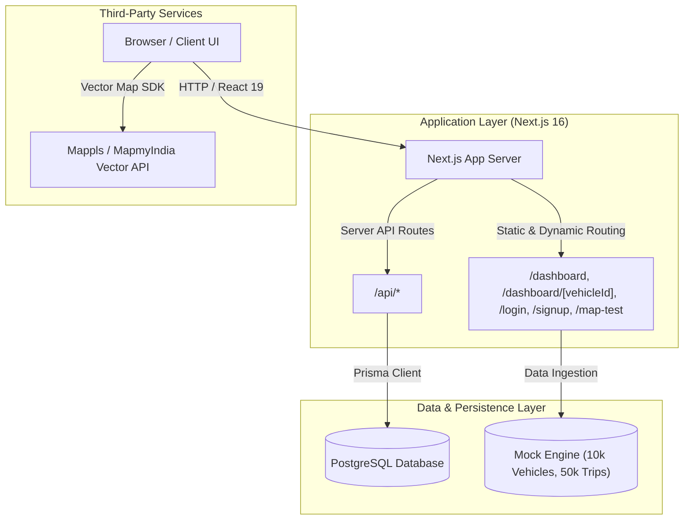

# Technical Requirements Document (TRD)

## Fleet Dashboard — SW2627 Data Product Development & Delivery Analytics

**Project Admin:** Shyam  
**Team Members:** Aryan, Praveen  
**Date Updated:** August 26, 2026  
**Status:** In Progress — Phase 2 / Technical Implementation  

---

## 1. Tech Stack Summary

| Layer | Technology | Version | Purpose & Rationale |
|---|---|---|---|
| **Framework** | Next.js (App Router) | 16.3.x | Hybrid server/client rendering, dynamic route handling, static optimization |
| **UI Library** | React | 19.2.x | Component lifecycle, hooks, and responsive rendering |
| **Styling** | Tailwind CSS | 4.x | Utility-first styling with fast compilation and zero runtime overhead |
| **Database** | PostgreSQL | 15+ | Relational persistence for user accounts, role definitions, and access logs |
| **ORM** | Prisma | 6.19.x | Type-safe database client, schema migrations, and relational queries |
| **Map SDK** | Mappls Web Maps | 3.8.x | Vector maps, custom markers, and geospatial visualization for Indian coordinates |
| **Data Engine** | TypeScript (`tsx`) | 4.20.x | Generates 10,000 synthetic vehicles and 50,000 trip logs |
| **Containerization**| Docker & Docker Compose | Latest | Standardized container builds using `node:20-alpine` |
| **Language** | TypeScript | 5.x | Strict type safety across frontend, backend handlers, and schemas |

---

## 2. Architecture Overview



### Architectural Pillars:
1. **Vehicle Directory View (`/dashboard`)**: Server/client rendering of fleet catalog with status badges, vehicle registration, and links to detailed views.
2. **Vehicle Detail & Trip Logs (`/dashboard/[vehicleId]`)**: Dynamic route extracting vehicle parameters, rendering vehicle metadata, historical trip tables, and map coordinate markers.
3. **Authentication & User Management**: User registration (`/signup`) and authentication (`/login`) backed by PostgreSQL through Prisma ORM with role classification (`ADMIN`, `USER`).
4. **Map SDK Integration (`/map-test`)**: Mappls vector map initialization injecting vector layers and marker placements dynamically on client hydration.

---

## 3. Authentication & Authorization (RBAC)

- **User Model**: Defined in `client/prisma/schema.prisma` and `client/database/users.sql`.
- **Password Security**: Passwords stored as salted hashes (e.g. bcrypt).
- **Role-Based Access Control**:
  - `ADMIN`: Full operational access, user account management, fleet-wide configuration.
  - `USER`: Read-only access to vehicle directory, trip logs, and vehicle maps.
- **Route Protection**: Middleware and server action guards verifying active sessions before rendering `/dashboard/*` routes.

---

## 4. Data Models

### 4.1 User Schema (`prisma/schema.prisma`)
```prisma
model User {
  id           Int      @id @default(autoincrement())
  name         String
  email        String   @unique
  phone        String?
  passwordHash String
  role         String   @default("user") // "admin" | "user"
  isActive     Boolean  @default(true)
  createdAt    DateTime @default(now())
  updatedAt    DateTime @updatedAt
}
```

### 4.2 Raw SQL Table Definition (`database/users.sql`)
```sql
CREATE TABLE users (
    id SERIAL PRIMARY KEY,
    name VARCHAR(100) NOT NULL,
    email VARCHAR(150) UNIQUE NOT NULL,
    password VARCHAR(255) NOT NULL,
    role VARCHAR(50) DEFAULT 'USER',
    created_at TIMESTAMP DEFAULT CURRENT_TIMESTAMP,
    updated_at TIMESTAMP DEFAULT CURRENT_TIMESTAMP
);
```

### 4.3 Vehicle Entity Interface
```typescript
interface Vehicle {
  id: string;                    // e.g. "vehicle-00001"
  name: string;                  // e.g. "Vehicle 1"
  registrationNumber: string;    // e.g. "RJ141001"
  status: "active" | "idle" | "offline";
  lastKnownLocation: {
    lat: number;
    lng: number;
    timestamp: string;
  };
}
```

### 4.4 Trip Entity Interface
```typescript
interface Trip {
  id: string;                    // e.g. "trip-000001"
  vehicleId: string;             // References Vehicle.id
  startTime: string;             // ISO Timestamp
  endTime: string;               // ISO Timestamp
  startLocation: { lat: number; lng: number };
  endLocation: { lat: number; lng: number };
  distanceKm: number;            // Distance in kilometers
}
```

---

## 5. Data Generation Engine

The mock data engine (`client/scripts/generateMockData.ts`) generates high-volume, realistic datasets for testing and development:

- **Volume**: 10,000 vehicles and 50,000 trips (5 trips per vehicle).
- **Geographic Bounding Box**: Clustered around Jaipur/Rajasthan coordinates (`26.9124° N, 75.7873° E ± 0.5°`).
- **Temporal Distribution**: Trip timestamps generated within a rolling 30-day window with realistic trip durations (30 min – 5 hours).
- **Execution Script**:
  ```bash
  npm run generate:mock
  ```
  Outputs `client/mock/vehicles.json` and `client/mock/trips.json`.

---

## 6. Docker & Containerization

- **Dockerfile**:
  - Base: `node:20-alpine`
  - Automated dependency caching via `npm ci`
  - Optimized Next.js standalone build: `RUN npm run build`
  - Production entrypoint: `CMD ["node", ".next/standalone/server.js"]`
- **Docker Compose**:
  - Single-command spin-up: `docker-compose up --build`
  - Port mapping: `3000:3000`
  - Automatic environment variable injection from `.env.local` or `.env`.

---

## 7. Performance & Scalability Considerations

1. **Memory Safety with Large Datasets**: Avoid importing the entire 17MB `trips.json` in client bundles; filter or query by `vehicleId` on the server.
2. **DOM Virtualization / Pagination**: Paginate or virtualize the 10,000-vehicle list to ensure minimal DOM nodes rendered simultaneously.
3. **Map SDK Lifecycle**: Dynamically load the Mappls script to prevent blocking initial page hydration and clean up map instances on component unmount.

---

## 8. Related Documents

- [Product Requirements Document (PRD)](./PRD.md)
- [UI/UX Design Document](./UIUX.md)
- [Root Readme](../readme.md)