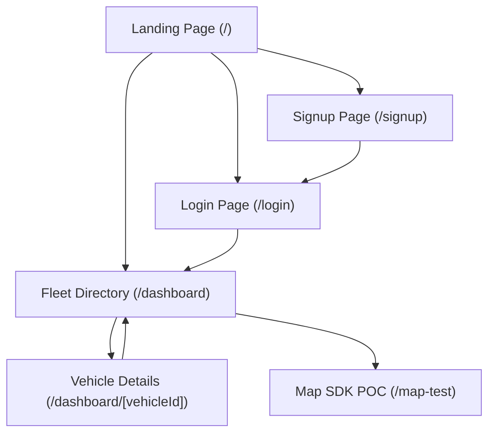

# UI/UX Design Specification Document

## Fleet Dashboard — SW2627 Data Product Development & Delivery Analytics

**Project Admin:** Shyam  
**Team Members:** Aryan, Praveen  
**Date Updated:** August 26, 2026  
**Status:** In Progress — Phase 2 Design & Implementation  

---

## 1. Purpose & UX Vision

The Fleet Dashboard aims to deliver a responsive, clean, and intuitive experience for fleet dispatchers, operations managers, and administrators. The interface prioritizes clear information hierarchy, high-contrast status visualization, and rapid navigation across large vehicle volumes.

---

## 2. User Flows & Navigation Hierarchy

---

## 3. Screen Specifications

### 3.1 Landing Page (`/`)
- **Header**: Persistent navigation with branding and quick links.
- **Hero Section**: Welcoming message and direct action links to Login, Signup, and Dashboard.
- **Footer**: Unified project footer and copyright/team information.

### 3.2 Authentication (`/login` & `/signup`)
- **Login (`/login`)**: Email and password fields with validation, link to registration, and "Back to Home" navigation.
- **Signup (`/signup`)**: Name, Email, Password, and Phone inputs with role selection and link to login.

### 3.3 Fleet Directory Dashboard (`/dashboard`)
- **Overview Header**: Total vehicle count indicator (`10,000 vehicles`) and dashboard title.
- **Vehicle Grid**: Responsive multi-column grid (`sm:grid-cols-2 lg:grid-cols-3`):
  - Vehicle Title (e.g. `Vehicle 1`)
  - Status Badge with color coding (`active`, `idle`, `offline`)
  - Registration Number badge (e.g. `RJ141001`)
  - Unique ID label (`vehicle-00001`)
  - Interactive hover transitions (`hover:shadow-md transition`)

### 3.4 Vehicle Detail View (`/dashboard/[vehicleId]`)
- **Header & Breadcrumb**: "← Back to Dashboard" navigation link.
- **Vehicle Metadata Card Grid**:
  - Vehicle ID
  - Registration Number
  - Current Status (capitalized badge)
  - Last Known Coordinates (`lat, lng`)
- **Trip History Table**:
  - Table Columns: Trip ID, Start Time, End Time, Distance (km), Start Coordinates, End Coordinates.
  - Formatted timestamps (`toLocaleString()`).
  - Distance formatted in kilometers (`X.XX km`).

### 3.5 Mappls Vector Map Component (`/map-test` / Detail View)
- Full-width vector map container.
- Custom interactive markers for vehicle coordinates.
- Interactive popups with vehicle metadata.

---

## 4. Design System & Design Tokens

### 4.1 Color Palette
| Token | Color Code / Utility | Usage |
|---|---|---|
| **Background Primary** | `#ffffff` (`bg-white`) / `#f8fafc` | Page backgrounds, card containers |
| **Border Neutral** | `#e2e8f0` (`border-gray-200`) | Card borders, table dividers |
| **Text Primary** | `#0f172a` (`text-gray-900`) | Headings, titles, key values |
| **Text Secondary** | `#64748b` (`text-gray-500`) | Subtitles, metadata labels, timestamps |
| **Status Active** | `bg-green-100 text-green-700` | Vehicles actively on trips |
| **Status Idle** | `bg-yellow-100 text-yellow-700` | Vehicles stopped with engine on / parked |
| **Status Offline** | `bg-gray-200 text-gray-600` | Disconnected or unpowered GPS units |
| **Interactive Accent** | `#2563eb` (`text-blue-600`) | Links, focus states, primary CTA buttons |

### 4.2 Typography
- **Font Family**: Inter / Geist / System Sans-serif fallback.
- **H1 / Main Titles**: `text-3xl font-bold`
- **H2 / Section Headers**: `text-2xl font-bold` or `text-lg font-semibold`
- **Body Text**: `text-sm text-gray-500`
- **Badges & Tags**: `text-xs font-medium`

### 4.3 Spacing & Layout
- 8pt spatial grid (`p-3`, `p-5`, `p-8`, `gap-4`, `mb-6`, `mb-8`).
- Maximum container width constrained to `max-w-6xl` for readability on widescreen monitors.

---

## 5. Responsive Design Principles

- **Mobile (< 640px)**: Single column vehicle list, horizontally scrollable trip history table (`overflow-x-auto`).
- **Tablet (640px – 1024px)**: 2-column grid layout for fleet directory, stacked map and metadata on detail view.
- **Desktop (1024px+)**: 3-column vehicle cards, full-width data grid with expansive map view.

---

## 6. Accessibility & Usability

- High contrast text-to-background ratios conforming to WCAG AA guidelines.
- Semantic HTML tags (`<main>`, `<section>`, `<header>`, `<footer>`, `<nav>`, `<table>`).
- Status indicators combine both distinct color backgrounds AND explicit text labels (`active`, `idle`, `offline`) so information is accessible to color-blind users.

---

## 7. Related Documents

- [Product Requirements Document (PRD)](./PRD.md)
- [Technical Requirements Document (TRD)](./TRD.md)
- [Root Readme](../readme.md)